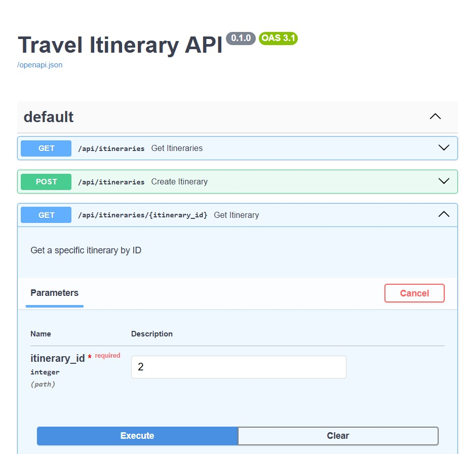

# Full-stack SDE Intern Assignment



## Objective

- Create a backend system for managing travel itineraries with the following components:

1. Database architecture for trip itineraries and models using SQLAlchemy
2. RESTful API endpoints for creating and viewing itineraries
3. MCP server that provides recommended itineraries based on duration

## Detailed Requirements

### 1. Database Architecture 📌

- **Design and implement the database schema using SQLAlchemy**
  - The schema should support:
    - Day-wise hotel accommodations
    - Transfers between locations
    - Activities/excursions
    - Relationships between these entities
  - Seed the database with realistic data for the Phuket and Krabi regions in Thailand.
  - Include recommended itineraries ranging from 2-8 nights.
  - Implement proper relationships, constraints, and indexes.

### 2. API Endpoints

- **Create RESTful API endpoints using FastAPI** that allow:
  - Creating a new trip itinerary
  - Viewing existing trip itineraries
- **Implement proper input validation, error handling, and response formatting**
- **Document the API with sample request/response formats**

#### Sample Endpoints:

- `POST /itineraries`: Create a new itinerary
- `GET /itineraries/{id}`: View an existing itinerary

### 3. MCP Server

- **Implement an MCP server** that returns recommended itineraries for a given number of nights.
  - Example Input: `2 nights`, `5 nights`
  - Example Output: A recommended itinerary for the requested number of nights.

## Project Setup

### Requirements

- Python 3.8+
- FastAPI
- SQLAlchemy
- PostgreSQL (or any other SQL database)
- Alembic (for database migrations)
- Docker (optional)

## 📂 Repository Structure

### Description:

- **main.py**: The entry point for running the FastAPI app and exposing the API endpoints.
- **mcp_server.py**: Implements the MCP server logic to recommend itineraries based on a given number of nights.
- **models.py**: Contains the SQLAlchemy models for the trip itinerary database schema, including relationships between accommodations, transfers, and activities.
- **run.py**: A script to run the FastAPI application and start the server.
- **README.md**: This file, which contains project documentation, setup instructions, and API details.
- **schemas.py**: Defines Pydantic models used for input validation and data serialization in requests and responses.
- **seed_data.py**: A script to populate the database with realistic sample data for the Phuket and Krabi regions, covering itineraries from 2 to 8 nights.


### Installation

1. Clone the repository:
   ```bash
   git clone https://github.com/your-username/travel-itinerary.git
   cd travel-itinerary


## To run the system:

### 1. Install the required dependencies:###
``` json 
pip install fastapi uvicorn sqlalchemy pydantic
```

### 2. Run the system:###
``` json
python run.py
```


# Usage 🚀

Create a new itinerary: POST /itineraries

**Request body:**

```json
{
  "destination": "Phuket",
  "duration": 5,
  "accommodations": [
    {
      "hotel": "Hotel Name",
      "check_in": "2025-05-01",
      "check_out": "2025-05-06"
    }
  ],
  "activities": [
    {
      "name": "Beach Visit",
      "day": 1
    }
  ]
}
```


**Response:**

```json
{
  "id": 1,
  "destination": "Phuket",
  "duration": 5,
  "status": "Created"
}
```


**View an itinerary: GET /itineraries/{id}**
**Response:**

``` json
{
  "id": 1,
  "destination": "Phuket",
  "duration": 5,
  "accommodations": [{"hotel": "Hotel Name", "check_in": "2025-05-01", "check_out": "2025-05-06"}],
  "activities": [{"name": "Beach Visit", "day": 1}]
}
```

## Get recommended itineraries: GET /mcp/recommended?duration=3
**Response:**

``` json
{
  "recommended_itinerary": [
    {"day": 1, "activity": "Visit Patong Beach"},
    {"day": 2, "activity": "Phi Phi Islands Tour"}
  ]
}
```


## Connect with Me 🚀

[](https://x.com/ManeeshKum14044)
[](https://github.com/maneeshmkp)
[](https://www.linkedin.com/in/maneeshmkp/)


## License 📜  

This project is licensed under the **MIT License** – see the [LICENSE](LICENSE) file for details.  

---

## Keep Learning and Exploring 🚀  

Happy coding! 😊 If you find this project helpful, give it a ⭐ on GitHub!  